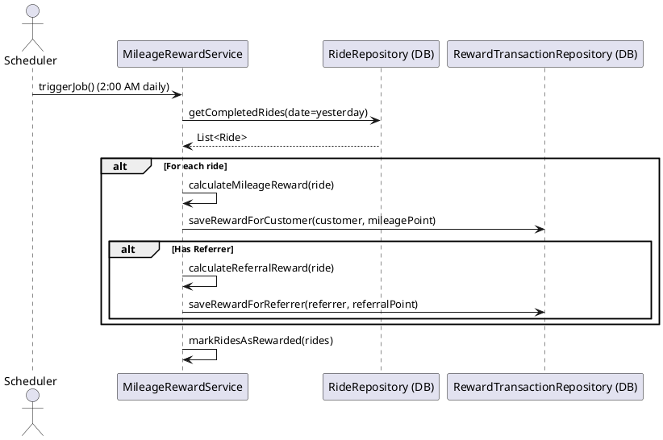

Dưới đây là **bản Markdown** chuyển đổi từ format bạn cung cấp. Các đoạn PlantUML, bảng, danh sách... đều được trình bày rõ ràng, dễ đọc.

---

# Solution Design: Mileage Reward Module

## 1. Sequence Diagram (PlantUML)

---

## 2. Solution & Components

### **A. Scheduler**

* Use **Spring Scheduler** (or Quartz) to trigger the job automatically at 2:00 AM daily.
* Ensure only one instance runs (Docker + distributed lock if running multiple nodes).

### **B. MileageRewardService**

* Query all rides completed on the previous day.
* For each ride:

  * Calculate customer reward: `mileagePoint = round(ride.distance * 1%)`
  * If there is a referrer: `referralPoint = round(ride.distance * 0.1%)`
  * Record reward transactions in the database (RewardTransaction table).
* Mark rides as rewarded to prevent duplicate processing (add a `rewarded` column or store transaction ID).

### **C. Database Repositories**

* **RideRepository**: Query completed rides and check reward status.
* **RewardTransactionRepository**: Record reward transactions.
* Use database transactions to ensure atomicity and avoid duplicate processing.

### **D. Thread-safety & Scalability**

* **Thread-safe**: Use transactions for each ride or batch, ensure no duplicate processing (unique constraints, optimistic/pessimistic locking).
* **Scalability**: Process rides in batches, use pagination, support parallel processing (multi-thread/batch workers).
* **Idempotency**: Check before saving reward to ensure each ride is rewarded only once.

### **E. Exception Handling**

* If ride data is invalid (missing customer/referrer), skip and log for review.
* If no referrer exists: reward only the customer.

---

## 3. Recommended Technologies

| Component        | Technology              | Reason                                    |
| ---------------- | ----------------------- | ----------------------------------------- |
| Scheduler        | Spring Scheduler        | Simple, easy integration with Spring      |
| ORM/Database     | JPA/Hibernate, Postgres | Reliable transactions, scalable           |
| Containerization | Docker                  | Consistent deployment, easy scaling       |
| Sequence Diagram | PlantUML                | Standard UML, CI/CD integration           |
| Lock/Idempotency | DB Transaction/Lock     | Ensure thread-safety, prevent duplication |

---

## 4. Technology Selection Rationale

* **Spring Scheduler**: Widely adopted, easy integration with other Spring modules.
* **JPA/Hibernate**: Convenient entity mapping, transaction management, supports locking.
* **Docker**: Ensures consistent deployment, simple scaling.
* **PlantUML**: Automated diagram generation, easy to read, CI/CD support.

---

## 5. Notes & Best Practices

* Ensure the job runs only once per day (use distributed lock for scaling).
* Record reward transactions within transaction scope.
* Log and alert on ride data errors or reward failures.
* Use batch size for large numbers of rides, scale with workers or pagination.

---

## 6. Processing Flow Summary

1. Scheduler triggers the job at 2:00 AM.
2. Service queries the list of rides completed yesterday and not yet rewarded.
3. Calculate and record rewards for each ride within a transaction.
4. Mark rides as rewarded to prevent duplicate processing.
5. Log errors for failed or invalid rides for later review.

---
